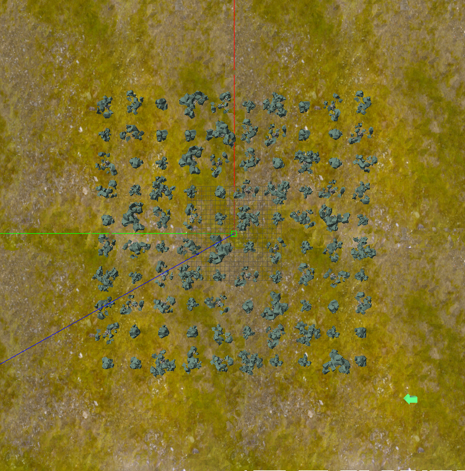
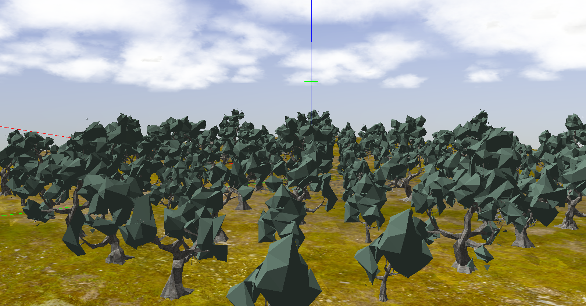
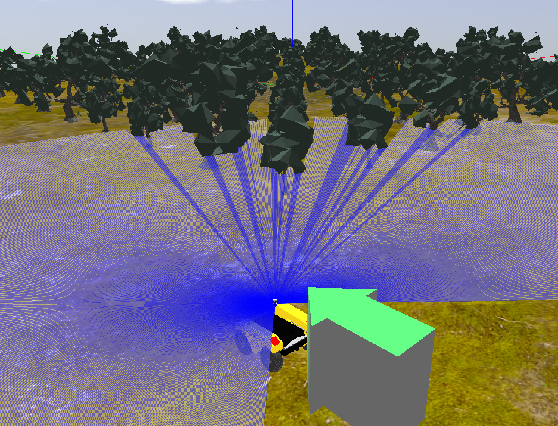

Olive Grove Gazebo
==========================================

This repository contains an additional  outdoor simulation environment for use with Clearpath's Warthog.


Launch Parameters
-------------------------------------------------------------

The world has a launch file which will start the simulation environment with a Warthog.  This launch file accept the following arguments:

Robot spawn position:
- `robot_x`
- `robot_y`
- `robot_z`
- `robot_yaw`

World spawn position:
- `world_x`
- `world_y`
- `world_z`
- `world_yaw`
This world default to (0, 0, 0, 0). If changing the world location, it may be necessary to
change the robot's spawn location as well, to prevent the robot from spawning in a location not above the ground plane.


## Launching

```roslaunch olive_grove_gazebo olive_grove.launch```

The spawn location for the robot can be specified by setting the `x`, `y`, `z`, and `yaw` variables.  The Z value should be set
to be above ground-level; otherwise the robot may fall through the ground plane as the environment renders.


Olive Grove World
-------------------------------------------------------------





This is an outdoor world with 100 olive trees arranged in a square grid. The ground is flat with a small structural noise for simulating the deformation of a terrain. The space between the trees is about 6 meters in all directions. An arrow has also been added to prevent orientation issues, it is also helpful during localization, pointing at robot spawning point.



